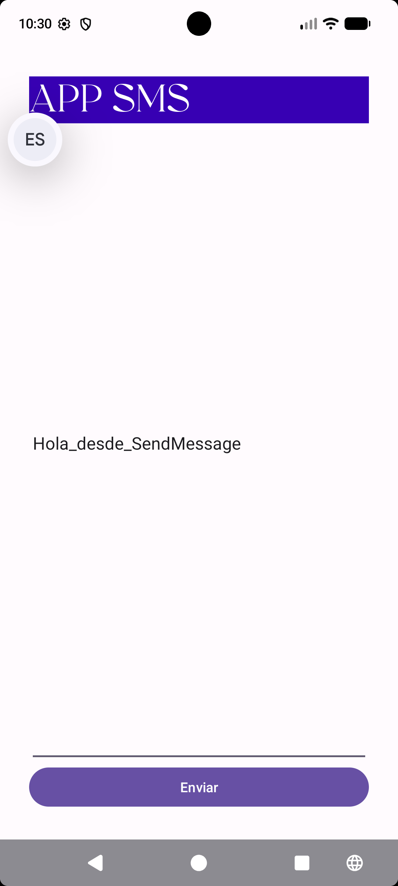
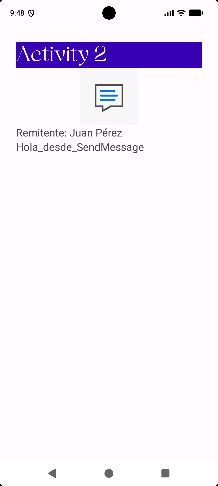
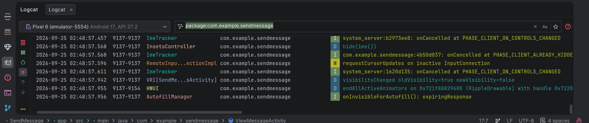
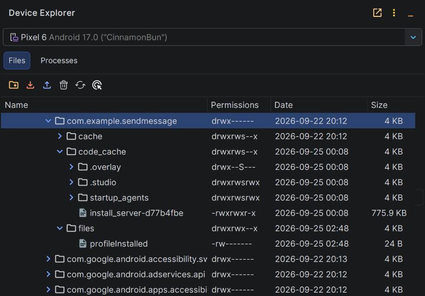

# SendMessage - App Android en Kotlin para enviar mensajes entre actividades

Aplicación nativa para Android desarrollada en Kotlin que permite redactar y enviar mensajes entre dos actividades (`SendMessagesActivity` y `ViewMessageActivity`) utilizando un `Intent` con un `Bundle`. Proyecto de ejemplo de desarrollo Android con XML Views, Material Design y arquitectura MVC.

---

## 📱 Capturas de Pantalla de la Aplicación en Ejecución

| Pantalla Principal (`SendMessagesActivity`) | Pantalla Secundaria (`ViewMessageActivity`) |
| :---: | :---: |
|  |  |

---

## ✨ Características

- **Envío de mensajes entre actividades:** transmite el texto desde `SendMessagesActivity` hasta `ViewMessageActivity` mediante un `Intent` explícito y un `Bundle` con la clave `KEY_MESSAGE`.
- **Modelo de datos Parcelable:** clases `Message` y `Person` anotadas con `@Parcelize` (kotlin-parcelize).
- **Navegación integrada:** grafo de navegación con Navigation Component (`res/navigation/nav_graph.xml`).
- **UI con XML Views y Material Design:** ConstraintLayout, ViewBinding y tema Material.
- **Internacionalización:** textos en `res/values/strings.xml` (español) e `res/values-en/strings.xml` (inglés), sin cadenas hardcodeadas.
- **Dimensiones centralizadas:** tamaños y márgenes en `res/values/dimens.xml` con cualificadores (`land`, `w600dp`, `w1240dp`).
- **Pantalla "Acerca de":** integración de la librería MaterialAbout.
- **Edge-to-edge:** contenido a pantalla completa sin solaparse con las barras del sistema (insets aplicados en ambas actividades).
- **Documentación KDoc:** generada con Dokka en la carpeta `documentation/`.

---

## 🏗️ Arquitectura y Stack Tecnológico

### Stack Tecnológico

| Categoría | Tecnología |
| :--- | :--- |
| Lenguaje | Kotlin 2.4.20 |
| Build System | Gradle 9.6.0 con AGP 9.4.1 y version catalog (`gradle/libs.versions.toml`) |
| SDK | compileSdk / targetSdk 37, minSdk 24 (Android 7.0) |
| Java | JDK 11 (source/target compatibility) |
| UI | XML Views, ConstraintLayout 2.1.4, Material Components 1.10.0, ViewBinding |
| Navegación | Navigation Component 2.6.0 (`navigation-fragment-ktx`, `navigation-ui-ktx`) |
| Arquitectura | MVC nativo con actividades independientes |
| Datos | Modelos `Parcelable` con `@Parcelize` (kotlin-parcelize) |
| AndroidX | core-ktx 1.19.0, appcompat 1.6.1, activity-ktx 1.13.0 |
| Terceros | MaterialAbout 0.3.0 (JitPack) |
| Documentación | Dokka 2.2.0 → `documentation/` |
| Testing | JUnit 4.13.2, Espresso 3.7.0, androidx.test.ext:junit 1.3.0 |

### Estructura de Paquetes
```
app/src/main/
├── java/com/example/sendmessage/
│   ├── SendMessageApplication.kt  # Clase global de la aplicación (Application)
│   ├── SendMessagesActivity.kt    # Actividad principal para redactar el mensaje
│   ├── ViewMessageActivity.kt     # Actividad secundaria para visualizar el mensaje
│   └── model/
│       ├── Message.kt             # Modelo de mensaje Parcelable (id, content, sender, receiver)
│       └── Person.kt              # Modelo de persona Parcelable (dni, name, surname)
└── res/
    ├── layout/
    │   ├── activity_send_messages.xml  # Diseño UI de la pantalla principal
    │   └── activity_view_message.xml   # Diseño UI de la pantalla secundaria
    ├── values/
    │   ├── colors.xml       # Paleta de colores de la aplicación
    │   ├── dimens.xml       # Dimensiones de texto y márgenes centralizados
    │   └── strings.xml      # Textos y cadenas de recursos (evita hardcoding)
    └── navigation/
        └── nav_graph.xml    # Grafo de navegación del proyecto
```

### Decisiones de Diseño y Arquitectura
- **Patrón de Arquitectura:** Basado en el patrón MVC nativo de Android con actividades independientes.
- **Paso de Parámetros:** Uso de `Intent` explícito empaquetado con `Bundle` para transferir datos de forma segura entre actividades.
- **Nomenclatura Húngara en CamelCase:**
  - `tv` para `TextView` (ej. `tvTitle`, `tvMessage`).
  - `et` para `EditText` (ej. `etMessageText`).
  - `bt` para `Button` (ej. `btSend`).
  - `iv` para `ImageView` (ej. `ivImage`).
- **Eliminación de Cadenas Hardcodeadas:** Todos los textos de interfaz están centralizados en `res/values/strings.xml` para cumplir con las mejores prácticas y soportar internacionalización.
- **Dimensiones Centralizadas:** Los tamaños de texto y márgenes se gestionan centralizadamente en `res/values/dimens.xml`.
- **Edge-to-edge y barras del sistema:** el tema (`res/values-v23/themes.xml`) usa barras de sistema transparentes. `ViewMessageActivity` aplica los insets en código (`ViewCompat.setOnApplyWindowInsetsListener` sobre `R.id.main`) y `SendMessagesActivity` mediante `android:fitsSystemWindows="true"` en la raíz de `activity_send_messages.xml`, por lo que el contenido no queda bajo la barra de estado ni la barra de navegación.

---

## 🚀 Comenzando

### Requisitos previos

- **Android Studio** con soporte para Android Gradle Plugin 9.4.1.
- **JDK 11** o superior.
- **Gradle 9.6.0** (incluido mediante Gradle Wrapper: `gradlew`).
- Dispositivo o emulador con **Android 7.0 (API 24)** o superior.

### Instalación y ejecución

1. Clonar el repositorio:
   ```bash
   git clone <URL_DEL_REPOSITORIO>
   ```
2. Abrir el proyecto en Android Studio (**File → Open**) y esperar a que sincronice Gradle.
3. Conectar un dispositivo con depuración USB activada o crear un emulador (**Device Manager**).
4. Ejecutar la configuración de run **app** (botón ▶) para instalar y lanzar la aplicación.

---

## 📦 Módulos y Componentes Principales

| Componente | Ruta | Descripción |
| :--- | :--- | :--- |
| `SendMessageApplication` | `java/com/example/sendmessage/` | Clase `Application` global |
| `SendMessagesActivity` | `java/com/example/sendmessage/` | Actividad principal (launcher): redacta y envía el mensaje |
| `ViewMessageActivity` | `java/com/example/sendmessage/` | Actividad secundaria: muestra el mensaje recibido |
| `Message` | `java/com/example/sendmessage/model/` | Modelo de mensaje Parcelable |
| `Person` | `java/com/example/sendmessage/model/` | Modelo de persona Parcelable (dni, name, surname) |
| `nav_graph.xml` | `res/navigation/` | Grafo de navegación entre pantallas |

> La app no expone API ni endpoints (sin backend); este apartado documenta los módulos internos.

---

## 🐛 Proceso de Depuración y Evidencias de Logcat

Durante la fase de desarrollo y pruebas, se realizó el siguiente proceso de depuración:
1. **Puntos de Interrupción (Breakpoints):** Se añadieron breakpoints dentro del listener `btSend.setOnClickListener` en `SendMessagesActivity.kt` para verificar que el texto ingresado en `etMessageText` se extrae correctamente.
2. **Inspección del Intent y Extras:** Se comprobó en la ventana de depuración de Android Studio que la clave `KEY_MESSAGE` contiene la cadena esperada antes del envío.
3. **Monitoreo con Logcat:** Se filtraron los logs por el paquete `com.example.sendmessage` para verificar el ciclo de vida de las actividades y asegurar que no existan excepciones ni fugas de memoria.

<p align="center">
  
</p>

---

## 📁 Conexión al Directorio `/data/data/` de la Aplicación

Para verificar los archivos internos de la aplicación en el almacenamiento privado del dispositivo o emulador:
1. Abrir **Android Studio**.
2. En la barra lateral derecha, seleccionar **Device File Explorer**.
3. Navegar a la ruta: `/data/data/com.example.sendmessage/`.
4. Ahí se encuentran las carpetas internas de la aplicación (`cache`, `code_cache`, `shared_prefs`, etc.).

<p align="center">
  
</p>

---

## 📚 Enlaces a la Documentación Oficial de Android Developer

- [Guía de Intents e Intent Filters](https://developer.android.com/guide/components/intents-filters?hl=es-419)
- [Paso de datos entre actividades con Bundles y Extras](https://developer.android.com/guide/components/activities/parcels-and-bundles?hl=es-419)
- [Gestión del Ciclo de Vida de una Actividad](https://developer.android.com/guide/components/activities/activity-lifecycle?hl=es-419)
- [Recursos de Cadenas de Texto (strings.xml)](https://developer.android.com/guide/topics/resources/string-resource?hl=es-419)

---

## 📄 Licencia y Contacto

- **Manual de usuario:** [MANUAL_USUARIO.md](MANUAL_USUARIO.md)
- **Registro de cambios:** [CHANGELOG.md](CHANGELOG.md)
- **Documentación KDoc (Dokka):** [documentation/index.html](documentation/index.html)
- **Autor:** Andrey Udodov
- **Licencia:** [Apache License 2.0](LICENSE) — permite usar, modificar y redistribuir el código bajo sus términos.
